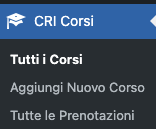
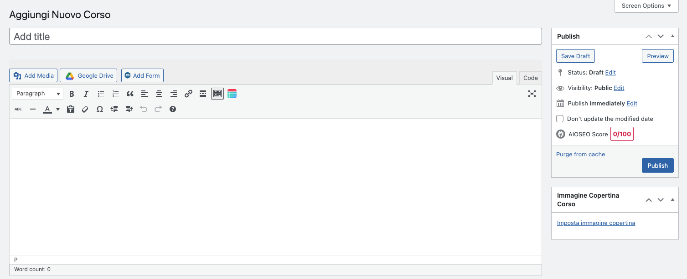
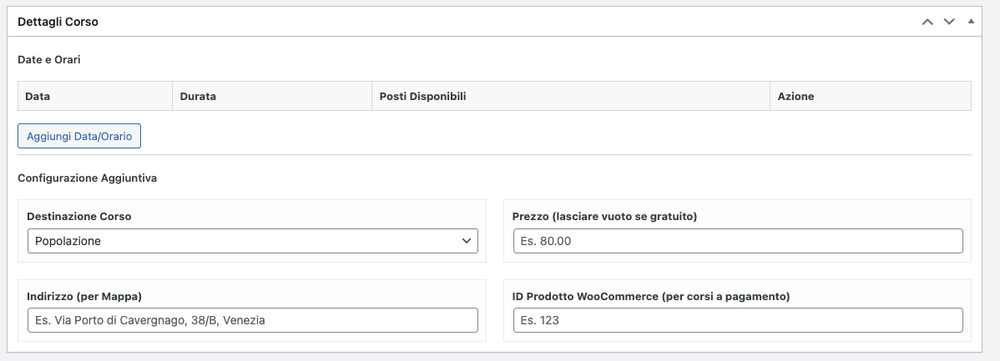
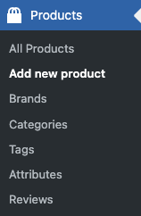

# Creare e Configurare un Corso

Questa guida spiega come creare un nuovo corso e configurare tutti i dettagli necessari per la sua pubblicazione e prenotazione.

## 1. Creare un Nuovo Corso

Per iniziare, accedi alla bacheca di WordPress e naviga su:

CRI Corsi > Aggiungi Nuovo

Si aprirà l'editor standard di WordPress (Classic Editor).

## 2. Campi Standard di WordPress

In questa sezione, compila i campi base del corso:

Titolo: Il nome ufficiale del corso (es. "Corso BLSD per la popolazione").

Editor di Testo: La descrizione completa del corso, cosa si impara, a chi è rivolto, ecc.

Immagine in Evidenza: (Sul lato destro) L'immagine principale del corso che apparirà nella griglia.

## 3. Il Riquadro "Dettagli Corso"

Sotto l'editor di testo principale, troverai il riquadro "Dettagli Corso". Qui si trova il cuore della configurazione del plugin.

- Date e Orari Corso

Questo è un "ripetitore": puoi aggiungere quante righe vuoi cliccando su "Aggiungi Riga". Ogni riga rappresenta una sessione prenotabile del corso.

**Data**: Seleziona la data della sessione dal calendario.

**Durata**: Un campo di testo per specificare la durata (es. "4 ore", "09:00 - 13:00").

**Posti Disponibili**: Il numero massimo di persone che possono iscriversi a questa specifica sessione.

- Configurazione Corso

Questi campi definiscono le regole principali del corso:

**Destinazione**:

- Popolazione: Per corsi standard aperti a tutti.

- Aziende: Seleziona questa opzione se il corso è per aziende. Attiverà i campi "Ragione Sociale" e "P.IVA" nel modulo di prenotazione.

**Prezzo**:

Inserisci il costo del corso (es. 50.00).

**Importante: Se il corso è gratuito, lascia questo campo vuoto. Il widget mostrerà automaticamente "Gratuito"**.

**ID Prodotto WooCommerce**:

Questo è il campo fondamentale per i corsi a pagamento.

Prima di compilare questo campo, devi aver creato un prodotto corrispondente in WooCommerce > Prodotti.

Inserisci qui l'ID numerico di quel prodotto.

Se i campi "Prezzo" e "ID Prodotto" sono entrambi compilati, il plugin reindirizzerà l'utente al carrello e al checkout di WooCommerce per il pagamento.

**Indirizzo (per Mappa)**:

Inserisci l'indirizzo completo dove si terrà il corso (es. Via Porto di Cavergnago, 38/B, Venezia).

Se compilato, il widget di Elementor mostrerà automaticamente una mappa Leaflet interattiva.

- Pubblicazione

Una volta compilati tutti i campi, clicca sul pulsante "Pubblica" (in alto a destra) come faresti per un normale articolo.

Il tuo corso è ora creato e pronto per essere aggiunto a una pagina tramite il widget Elementor.